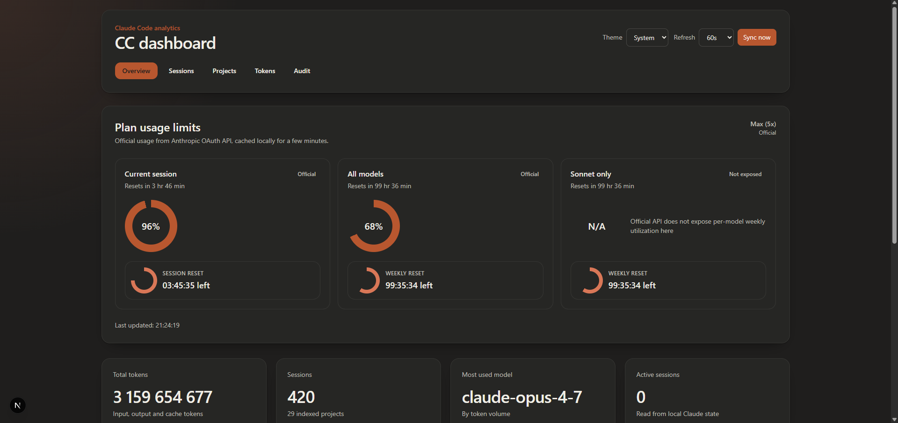
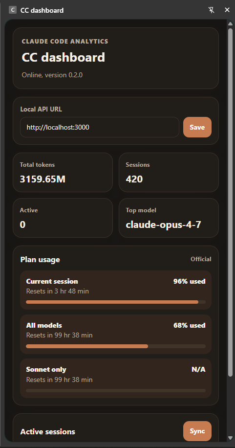

# CC dashboard v0.3.0

**CC dashboard** is a local-first analytics dashboard for Claude Code usage. It shows sessions, projects, token trends, active sessions and plan utilization, and can run as a web app, Docker container, Windows service, or Chrome side panel.


## About

This project is designed for local workstation use and privacy-first observability:

- it indexes Claude Code metadata from local JSONL files,
- stores only derived metrics in SQLite,
- never stores prompt text or assistant response text,
- keeps the default runtime bound to `127.0.0.1`.

## Screenshots

Screenshots showing the main dashboard and the Chrome side panel extension.

### Main app



### Chrome extension



## Features

- ✅ **Localhost-first by design** - Binds to `127.0.0.1` by default; no remote access, no authentication, no telemetry
- ✅ **Metadata-only privacy guard** - Never stores prompt text, assistant responses or message content; tests enforce forbidden content fields
- ✅ **JSONL incremental indexer** - Reads Claude Code session JSONL files, tracks `mtime` and size, then reparses only changed files
- ✅ **SQLite with WAL mode** - Local read/write concurrency without external services; configurable via `DATABASE_PATH`
- ✅ **Five live dashboard views** - Overview, Sessions, Projects, Tokens and Audit, with SWR-driven polling
- ✅ **Active sessions panel** - Reads live Claude Code session state from disk (PID, cwd, updated-at)
- ✅ **Plan usage donuts** - Current 5-hour session block, weekly all-models, weekly Sonnet, daily routine runs (official OAuth source when available, local estimate as fallback)
- ✅ **Configurable refresh intervals** - `OFF`, `30 s`, `60 s`, `180 s`, `300 s`, persisted in `localStorage`
- ✅ **Three runtime surfaces** - npm production, Docker Compose, or Windows background service via WinSW
- ✅ **Single-process database lock** - Optional `.lock` file beside SQLite for managed runtimes (`CC_DASHBOARD_ENABLE_DB_LOCK=1`)
- ✅ **Chrome Manifest V3 side panel** - Thin client scoped to `http://localhost/*` and `http://127.0.0.1/*`; no broad host permissions
- ✅ **Light, dark and system themes** - CSS variables and `prefers-color-scheme` resolution stored in `localStorage`
- ✅ **Defensive JSONL parser** - Treats Claude Code JSONL as an internal, unstable format; counts only token usage and tool-use entries
- ✅ **Honors `CLAUDE_CONFIG_DIR`** - First-class override for non-standard Claude Code data directories
- ✅ **GitHub Actions CI** - Lint, typecheck, test and build matrix on every push and pull request
- ✅ **Comprehensive test suite** - Vitest with Testing Library and jsdom for parser, privacy, sync, API and UI components

## Requirements

- **Node.js**: 22 LTS or newer
- **npm**: 10+
- **Operating system**: Windows, macOS or Linux
- **Optional - Docker**: 24+ with Docker Compose v2
- **Optional - WinSW**: x64 binary for Windows background service mode (not committed to the repo)
- **Optional - Chrome**: 114+ for the Manifest V3 side panel
- **Claude Code installation**: Required to produce the JSONL session data the dashboard indexes

## How to use

Run with npm (default path):

```bash
npm install
cp .env.example .env
# edit .env and set CLAUDE_DATA_PATH
npm run build
npm run start
```

Then open `http://localhost:3000`.

Run with Docker:

```bash
cp .env.example .env
docker compose up --build -d
```

Run with WinSW service (Windows):

```powershell
.\packaging\windows\Install-Service.ps1 -RunAsCurrentUser
```

## Installation

### Using npm (default)

```bash
# Clone the repository (replace placeholder once the repo is published)
git clone https://github.com/<your-org>/cc-dashboard.git
cd cc-dashboard

# Install dependencies (includes a native rebuild of better-sqlite3 on first dev run)
npm install

# Configure environment
cp .env.example .env
# Edit .env: at minimum set CLAUDE_DATA_PATH

# Build and start the production server
npm run build
npm run start
```

The server listens on `http://localhost:3000` (bound to `127.0.0.1` by `next start -H 127.0.0.1`).

### Using Docker Compose

```bash
# Configure environment
cp .env.example .env
# Edit .env: set CLAUDE_DATA_PATH (forward slashes, even on Windows)

# Build and run in the background
docker compose up --build -d
```

Compose binds the container to `127.0.0.1:${HOST_PORT:-3000}`, mounts the host Claude Code directory as **read-only** at `/claude-data`, and stores SQLite in a named volume (`dashboard-db`) at `/data/dashboard.db`.

### Using Windows service (WinSW)

WinSW packaging keeps the dashboard running in the background without an open `npm run dev` shell. Binaries are not committed - download them once and reuse the bundled scripts.

```powershell
# 1. Download WinSW x64 from https://github.com/winsw/winsw/releases
# 2. Save it as packaging/windows/bin/cc-dashboard-service.exe
# 3. Run the installer from an elevated PowerShell

.\packaging\windows\Install-Service.ps1 -RunAsCurrentUser
```

The installer runs `npm ci` and `npm run build`, writes a WinSW XML configuration under `%LOCALAPPDATA%\CCDashboard\service`, registers the service, and stores SQLite under `%LOCALAPPDATA%\CCDashboard\data`. To remove the service:

```powershell
.\packaging\windows\Uninstall-Service.ps1
```

See [`packaging/windows/cc-dashboard-service.xml.example`](./packaging/windows/cc-dashboard-service.xml.example) for the full environment, restart policy and log rotation defaults.

## Quick start

After installation, the minimum reproducible flow is:

1. Set `CLAUDE_DATA_PATH` (or `CLAUDE_DATA_DIR` / `CLAUDE_CONFIG_DIR`) in `.env`. On Windows, use forward slashes:

   ```ini
   CLAUDE_DATA_PATH=C:/Users/you/.claude
   DATABASE_PATH=./data/dashboard.db
   PORT=3000
   REFRESH_INTERVAL=60
   ```

2. Run `npm run start` and open `http://localhost:3000`.
3. Optional: load `extension/chrome` as an unpacked Chrome extension and click the action icon to open the side panel.

## Configuration

All settings are environment variables. The dashboard reads them lazily, so a restart is required after changes.

| Variable | Default | Description |
|----------|---------|-------------|
| `CLAUDE_CONFIG_DIR` | unset | Highest-priority override for the Claude Code data directory |
| `CLAUDE_DATA_DIR` | unset | Secondary override for the Claude Code data directory |
| `CLAUDE_DATA_PATH` | unset | Tertiary override; primarily used by `compose.yaml` |
| `DATA_DIR` | `/data` | Base directory for application data; used to derive defaults |
| `DATABASE_PATH` | `${DATA_DIR}/dashboard.db` | Absolute path to the SQLite database file |
| `PORT` | `3000` | HTTP port for `next start` |
| `CC_DASHBOARD_ENABLE_DB_LOCK` | unset | Set to `1` to create a `.lock` file beside the database (managed runtimes only - not for `next dev`) |
| `CC_DASHBOARD_DISABLE_USAGE_API` | unset | Set to `1` (or `true`) to opt out of the external Anthropic usage API call. The dashboard then uses the local JSONL estimate instead of authoritative data. See [ADR-0005](docs/decisions/0005-external-usage-api.md). |
| `REFRESH_INTERVAL` | `60` | Default UI polling interval in seconds; allowed: `0`, `30`, `60`, `180`, `300` |
| `PLAN_DAILY_ROUTINE_LIMIT` | `15` | Daily routine-run quota for the plan usage card |
| `PLAN_SESSION_TOKEN_BUDGET` | `1000000` | Token budget for the rolling 5-hour session block |
| `PLAN_WEEKLY_TOKEN_BUDGET` | `5000000` | Token budget for the weekly all-models usage card |
| `PLAN_WEEKLY_SONNET_TOKEN_BUDGET` | `5000000` | Token budget for the weekly Sonnet-only usage card |

**Resolution chain for the Claude Code data directory:** `CLAUDE_CONFIG_DIR` &rarr; `CLAUDE_DATA_DIR` &rarr; `CLAUDE_DATA_PATH` &rarr; `/claude-data` (Docker) or `~/.claude` (native). The first defined value wins.

Example environment configuration:

```bash
export CLAUDE_DATA_PATH=$HOME/.claude
export DATABASE_PATH=./data/dashboard.db
export PORT=3000
export REFRESH_INTERVAL=30
```

## API reference

The dashboard exposes seven JSON route handlers under `/api`. All endpoints accept and return `application/json`. There is no authentication; localhost binding is the security boundary.

### 1. GET /api/health

Lightweight liveness probe used by the Docker `healthcheck` and the Chrome side panel. Verifies SQLite connectivity (`SELECT 1`).

**Parameters:** none.

**Response:**

```json
{
  "status": "ok",
  "version": "0.3.0",
  "db": "ok"
}
```

**Example:**

```bash
curl http://localhost:3000/api/health
```

### 2. GET /api/sessions

Returns paginated session metadata, joined with project names. Sessions are ordered by `started_at DESC` (falling back to `indexed_at`).

**Parameters:**

| Name | Type | Default | Description |
|------|------|---------|-------------|
| `limit` | integer | `50` | Maximum sessions to return; clamped to `200` |
| `offset` | integer | `0` | Number of sessions to skip; clamped to `>= 0` |

**Response:** `{ "sessions": Array<SessionRow> }`, where each `SessionRow` includes:

```text
id, model, models[], startedAt, endedAt, durationSeconds,
inputTokens, outputTokens, cacheReadTokens, cacheWriteTokens,
totalTokens, messageCount, toolCalls, gitBranch, cwd,
projectName, projectPath
```

**Example:**

```bash
curl "http://localhost:3000/api/sessions?limit=20&offset=0"
```

### 3. GET /api/projects

Lists projects grouped by Claude Code working directory or detected Git root, with aggregated session counts and token totals.

**Parameters:** none.

**Response:** `{ "projects": Array<ProjectRow> }`, where each `ProjectRow` includes:

```text
id, name, path, firstSeenAt, lastSeenAt,
sessions, totalTokens, lastSessionAt
```

**Example:**

```bash
curl http://localhost:3000/api/projects
```

### 4. GET /api/active-sessions

Reads live Claude Code session state from JSON files under `${CLAUDE_DATA_DIR}/sessions/`. This endpoint does **not** query SQLite - it reflects the current process state on the host.

**Parameters:** none.

**Response:**

```json
{
  "activeSessions": [
    {
      "id": "string",
      "name": "string|null",
      "status": "string|null",
      "pid": 12345,
      "cwd": "string|null",
      "updatedAt": "ISO-8601 string|null"
    }
  ]
}
```

**Example:**

```bash
curl http://localhost:3000/api/active-sessions
```

### 5. GET /api/stats/overview

Returns aggregate statistics across all indexed sessions: token totals, model breakdown, a 90-day daily timeline and the most-used model.

**Parameters:** none.

**Response:**

```text
{
  sessions, projects,
  totalTokens, inputTokens, outputTokens, cacheTokens,
  toolCalls, averageDurationSeconds, mostUsedModel,
  timeline:        [{ date, totalTokens, sessions }],
  modelBreakdown:  [{ model, totalTokens, sessions }]
}
```

**Example:**

```bash
curl http://localhost:3000/api/stats/overview
```

### 6. GET /api/usage-limits

Returns plan usage donuts. When the official Anthropic OAuth API is reachable, it powers `currentSession` and `weekly[]` directly (`source: "official"`). Otherwise the values are estimated locally from indexed JSONL (`source: "local"`).

**Parameters:** none.

**Response:**

```text
{
  generatedAt, planLabel, source: "official" | "local",
  currentSession: UsageLimitRow,
  weekly:     UsageLimitRow[],
  additional: UsageLimitRow[],
  note,
  error?
}

UsageLimitRow = {
  id, label, description,
  used, max, percentage,
  resetAt, resetLabel,
  valueLabel?, quotaLabel?
}
```

**Example:**

```bash
curl http://localhost:3000/api/usage-limits
```

### 7. GET /api/sync and POST /api/sync

`GET` returns the last incremental sync status. `POST` triggers a fresh incremental sync, comparing each JSONL file's `mtime` and size against `sync_files` and reparsing only changed files.

**Parameters:** none for either method.

**CSRF protection (POST):** the dashboard rejects any `POST /api/sync` request that does not carry the header `X-Requested-With: cc-dashboard`. This prevents a malicious page that the user happens to visit from triggering a sync via cross-origin `fetch`. The web UI and Chrome extension already include the header; external integrations must do the same.

**Concurrency:** if a sync is already in flight, a second `POST /api/sync` shares the same in-flight Promise and returns the same status. There is no need for the client to back off or queue.

**Response:** `{ "status": SyncStatus | null }`, where:

```text
SyncStatus = {
  scannedFiles, indexedFiles, skippedFiles, failedFiles,
  indexedFacets, startedAt, finishedAt,
  errors: [{ file, message }]   // file is a basename, message is sanitized
}
```

`GET` returns `status: null` until the first sync has run.

**Examples:**

```bash
# Read last status
curl http://localhost:3000/api/sync

# Trigger a sync (note the required header)
curl -X POST -H 'X-Requested-With: cc-dashboard' http://localhost:3000/api/sync
```

## UI surfaces

### Web dashboard

Five server-rendered pages, all backed by the same SWR polling hook (`useDashboardData`):

| Route | Description |
|-------|-------------|
| `/` | Overview - 4 stat cards (total tokens, sessions, top model, active sessions) plus token timeline and model breakdown |
| `/sessions` | Recent sessions table with project, model, duration and token columns |
| `/projects` | Project cards grouped by Claude Code working directory, sorted by total tokens |
| `/tokens` | Token statistics: input/output/cache totals, 90-day timeline, model breakdown chart |
| `/audit` | Sync status (scanned, indexed, skipped, failed files) and the live active sessions list |

### Chrome side panel

The Manifest V3 side panel in `extension/chrome/` is a thin client for the same backend. The full dashboard tab and the side panel can stay open simultaneously.

1. Start the local backend (npm, Docker or the Windows service).
2. Open `chrome://extensions`.
3. Enable Developer mode.
4. Choose Load unpacked.
5. Select `extension/chrome`.
6. Click the extension icon to open the side panel.

The panel persists the local API base URL in `chrome.storage.local` (default `http://localhost:3000`) and only requests the `sidePanel`, `storage`, `http://localhost/*` and `http://127.0.0.1/*` permissions. It refreshes every 60 s and polls `/api/health`, `/api/stats/overview`, `/api/usage-limits` and `/api/active-sessions`.

## Project structure

```
cc-dashboard/
├── .github/workflows/             # GitHub Actions CI (ci.yml: lint, typecheck, test, build)
├── docs/
│   ├── architecture.md            # Data flow, storage, theme system, runtime surfaces
│   ├── runbook.md                 # Operational checklists (install service, backup, troubleshoot)
│   └── decisions/                 # ADR records
├── extension/chrome/              # Chrome Manifest V3 side panel
│   ├── manifest.json
│   ├── background.js
│   ├── sidepanel.html
│   ├── sidepanel.js
│   └── sidepanel.css
├── packaging/windows/             # WinSW Windows service packaging (binary not committed)
│   ├── cc-dashboard-service.xml.example
│   ├── Install-Service.ps1
│   ├── Uninstall-Service.ps1
│   └── README.md
├── public/                        # Static assets served by Next.js
├── src/
│   ├── app/
│   │   ├── api/                   # Route handlers (7 endpoints)
│   │   │   ├── active-sessions/route.ts
│   │   │   ├── health/route.ts
│   │   │   ├── projects/route.ts
│   │   │   ├── sessions/route.ts
│   │   │   ├── stats/overview/route.ts
│   │   │   ├── sync/route.ts
│   │   │   └── usage-limits/route.ts
│   │   ├── audit/page.tsx
│   │   ├── projects/page.tsx
│   │   ├── sessions/page.tsx
│   │   ├── tokens/page.tsx
│   │   ├── layout.tsx
│   │   └── page.tsx               # Overview landing
│   ├── components/                # UI building blocks (charts, cards, theme provider)
│   ├── hooks/                     # use-dashboard-data, use-auto-sync, use-refresh-interval, use-theme
│   ├── lib/
│   │   ├── api/queries.ts         # SQLite queries for the route handlers
│   │   ├── claude/                # JSONL parser, scanner, active sessions, usage API
│   │   ├── db/                    # Drizzle client, migrate, schema
│   │   ├── privacy/               # assert-metadata-only forbidden-keys validator
│   │   └── sync/indexer.ts        # Incremental sync (mtime/size diffing)
│   ├── test/fixtures/             # Demo JSONL session data
│   ├── __tests__/                 # Vitest unit and integration tests
│   └── config.ts                  # APP_VERSION, env helpers, refresh intervals
├── .env.example                   # Documented environment template
├── CHANGELOG.md
├── CLAUDE.md                      # Project guidance for AI coding assistants
├── compose.yaml                   # Docker Compose service definition
├── Dockerfile                     # Multi-stage Node 22 image
├── drizzle.config.ts
├── eslint.config.mjs
├── LICENSE
├── next.config.ts
├── package.json
├── postcss.config.mjs
├── README.md                      # This file
├── SECURITY.md                    # Local-first warning, vulnerability policy
├── tailwind.config.ts
├── tsconfig.json
└── vitest.config.ts
```

## Docker

The `Dockerfile` is a three-stage `node:22-bookworm-slim` build (deps - builder - runner) that produces a Next.js standalone server running as the unprivileged `nextjs:nodejs` user (uid 1001).

```dockerfile
FROM node:22-bookworm-slim AS runner
WORKDIR /app
ENV NODE_ENV=production
ENV HOSTNAME=0.0.0.0
ENV PORT=3000
ENV DATA_DIR=/data
ENV DATABASE_PATH=/data/dashboard.db
ENV CLAUDE_DATA_DIR=/claude-data
USER nextjs
EXPOSE 3000
CMD ["node", "server.js"]
```

`compose.yaml` defines a single `dashboard` service with hardened defaults:

```yaml
services:
  dashboard:
    ports:
      - "127.0.0.1:${HOST_PORT:-3000}:3000"
    volumes:
      - type: bind
        source: ${CLAUDE_DATA_PATH}
        target: /claude-data
        read_only: true
      - type: volume
        source: dashboard-db
        target: /data
    cap_drop: [ALL]
    security_opt: [no-new-privileges:true]
    restart: unless-stopped
```

Build, run and inspect:

```bash
# Validate the Compose file
docker compose config

# Start in the background
docker compose up --build -d

# Tail logs
docker compose logs -f

# Stop
docker compose down
```

For the read-only mount verification and the SQLite backup procedure, see [`docs/runbook.md`](./docs/runbook.md).

## Windows service

The bundled WinSW configuration is intended for workstations that should keep the dashboard reachable across logoffs and restarts.

**Install** (elevated PowerShell):

```powershell
.\packaging\windows\Install-Service.ps1 -RunAsCurrentUser
```

**Uninstall** (elevated PowerShell):

```powershell
.\packaging\windows\Uninstall-Service.ps1
```

The service template sets `CC_DASHBOARD_ENABLE_DB_LOCK=1`, which creates a `.lock` file next to `dashboard.db` so a second service instance cannot start against the same database. **Do not enable this flag for `npm run dev`** - Next.js can spawn more than one process during development, and SQLite WAL already handles normal local read/write concurrency.

Logs roll under `%LOCALAPPDATA%\CCDashboard\service\logs`. Override defaults with `-DataDirectory`, `-ClaudeDataDirectory`, `-Port` or `-ServiceDirectory`. See [`packaging/windows/README.md`](./packaging/windows/README.md) for the full parameter list.

## Architecture and operations

For deeper documentation:

- [`docs/architecture.md`](./docs/architecture.md) - data flow from Claude Code JSONL to SQLite to the UI, storage layout, privacy guard, theme system and runtime surfaces (with a Mermaid diagram).
- [`docs/runbook.md`](./docs/runbook.md) - operational checklists: starting locally, installing/uninstalling the Windows service, validating Docker configuration, checking health, triggering a sync, verifying the read-only Claude mount, backing up SQLite and resolving common Windows path issues.
- [`docs/decisions/`](./docs/decisions/) - architectural decision records (ADRs).
- [`SECURITY.md`](./SECURITY.md) - vulnerability reporting and the local-first warning.

## Development

### Setup

```bash
npm install
```

`npm install` triggers a native rebuild of `better-sqlite3` on first dev run (`predev` hook: `npm rebuild better-sqlite3 --foreground-scripts`).

### Running the server

```bash
# Development server with hot reload
npm run dev

# Production server (binds to 127.0.0.1)
npm run start

# Production server exposed to LAN (opt-in only)
npm run start:lan
```

> [!WARNING]
> **`start:lan` exposes the API to your local network with no authentication.** Only use this on a trusted network (home Wi-Fi, etc.). Anyone reachable on the network can read your Claude Code metadata via the API. The dashboard is **localhost-first by design**; LAN exposure is opt-in for convenience.

### Running tests

```bash
# One-shot run
npm test

# Watch mode
npm run test:watch
```

Tests live under `src/__tests__/` and cover the JSONL parser, privacy guard, incremental sync, route handlers and key UI components. The framework is **Vitest** with `@testing-library/react`, `@testing-library/jest-dom` and `jsdom`.

### Database commands

```bash
# Generate Drizzle migration files from schema changes
npm run db:generate

# Apply migrations
npm run db:migrate
```

### Code quality and validation

The project follows the conventions encoded in `CLAUDE.md`:

- **Modular architecture** - separated route handlers, queries, parsers, sync logic and UI components
- **Strict typing** - TypeScript with full Drizzle inference for DB rows
- **Async I/O** - all filesystem and network calls go through `async/await`
- **Privacy by construction** - parser intentionally drops content fields; `assertMetadataOnly` validator rejects forbidden keys
- **Server-side rendering** - dashboard pages are `force-dynamic` SSR; client polling via SWR

Run the validation gate after substantive changes:

```powershell
npm run lint
npm run typecheck
npm test
npm run build
docker compose config
```

For Chrome extension changes, also load `extension/chrome` unpacked and verify that it can reach `http://localhost:3000/api/health`.

## Changelog

See [`CHANGELOG.md`](./CHANGELOG.md) for release history.

## Contributing

1. Fork the repository.
2. Create a feature branch (`git checkout -b feature/amazing-feature`).
3. Commit using **Conventional Commits 1.0.0** format (e.g. `feat: add weekly sonnet donut`, `fix(parser): ignore partial assistant rows`).
4. Add or update tests for new functionality.
5. Run the full validation gate (`lint`, `typecheck`, `test`, `build`).
6. Push the branch and open a pull request against `main`.

Guidelines:

- Use English for all code and documentation.
- Keep async I/O the default for parser, sync and route-handler changes.
- Update `CHANGELOG.md` with user-visible changes.
- Update `docs/architecture.md` or `docs/runbook.md` when behavior or operational steps change.
- Do not add authentication, broad host permissions or remote-access features unless explicitly requested - the project is intentionally localhost-first.

GitHub fork URLs and the issue tracker will be available once the public repository is published.

## License

This project is licensed under the MIT License. See [`LICENSE`](./LICENSE) for details.

## Privacy model

The dashboard is intentionally metadata-only. The JSONL parser reads message content only to count `tool_use` entries, then discards it. Persisted session rows include token counts, timestamps, models, project paths and aggregate metrics - never `content`, `prompt`, `response`, `messages`, `transcript` or `conversation`. The `assertMetadataOnly` validator at `src/lib/privacy/assert-metadata-only.ts` enforces this contract at runtime, and unit tests reject any regression that smuggles content fields into API payloads.

The implementation borrows several proven ideas from `sirmalloc/ccstatusline`:

- Respect `CLAUDE_CONFIG_DIR` for non-standard Claude Code data directories.
- Count streaming JSONL token usage defensively to avoid overcounting partial assistant rows.
- Use file metadata and cached sync state to avoid reparsing unchanged transcripts.
- Keep live/session metadata separate from heavier historical transcript parsing.

## Author

**[@numikel](https://github.com/numikel)**

Developed with help from:


And with models:


---

**Local-first warning:** This dashboard is intended for local use on a single workstation. It does not implement authentication or remote-access controls - do not expose it to a public network or LAN without adding your own authentication layer in front of it. See [`SECURITY.md`](./SECURITY.md) for the vulnerability reporting policy.
