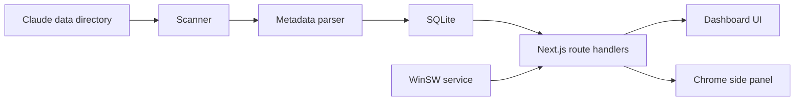

# Architecture

## Overview

CC dashboard is a localhost-first Next.js application. It reads Claude Code metadata from a configured local data directory, indexes derived session metrics into SQLite and renders a local web dashboard on `localhost`. A Chrome side panel can run in parallel as a lightweight client for the same API.

## Data flow

1. `scanClaudeJsonlFiles()` scans `CLAUDE_CONFIG_DIR`, `CLAUDE_DATA_DIR` or `CLAUDE_DATA_PATH`.
2. `parseClaudeJsonlSession()` reads each JSONL file line by line.
3. The parser extracts timestamps, model identifiers, token usage, tool-use counts, Git branch and working directory metadata.
4. `runIncrementalSync()` compares file `mtime` and size with `sync_files`.
5. Changed files are upserted into SQLite.
6. Route handlers expose aggregate data to the full web UI and the Chrome side panel.
7. SWR refreshes dashboard data and can trigger sync on the selected interval.

## Storage

SQLite is stored at `/data/dashboard.db` in Docker and should be configured through `DATABASE_PATH` for native runtimes. WAL mode is enabled to reduce read/write contention. Managed single-process runtimes can opt into a `.lock` file beside the database with `CC_DASHBOARD_ENABLE_DB_LOCK=1`; this is enabled by the WinSW service template and intentionally disabled for `next dev`.

Main tables:

- `projects`
- `sessions`
- `sync_files`
- `facets`
- `settings`

## Privacy

The parser never persists full message content. Facets are indexed only when they pass a strict metadata-only whitelist. The privacy guard rejects content-like keys.

## ccstatusline influence

`ccstatusline` informed three implementation details:

- `CLAUDE_CONFIG_DIR` is honored as a first-class data directory override.
- Streaming JSONL assistant rows are counted carefully to avoid double-counting partial responses.
- Heavy parsing is avoided for unchanged files by storing sync state.

## Theme system

Theme state is stored in `localStorage`. `system` resolves through `prefers-color-scheme`. CSS variables in `src/app/globals.css` define the visual tokens.

## Runtime surfaces

- The full web dashboard is served by Next.js on `http://localhost:3000` by default.
- The Windows service packaging uses WinSW to run `npm run start` with explicit `PORT`, `DATA_DIR`, `DATABASE_PATH`, `CLAUDE_DATA_DIR` and `CC_DASHBOARD_ENABLE_DB_LOCK` values.
- The Chrome side panel in `extension/chrome` is a static Manifest V3 extension page. It stores the local API URL in `chrome.storage.local` and fetches only from `localhost` or `127.0.0.1` permissions.
